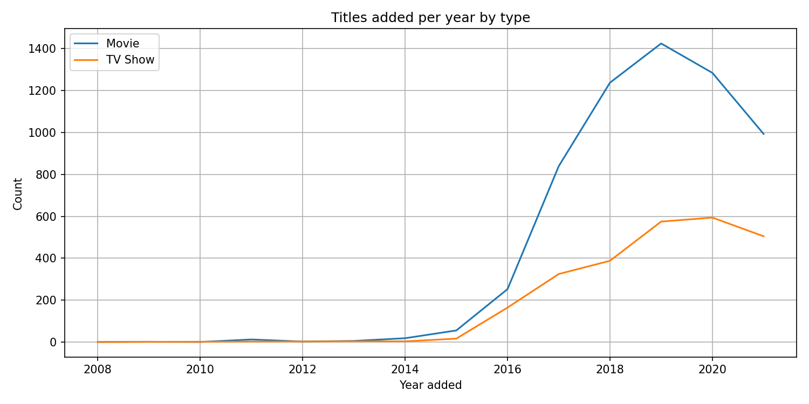
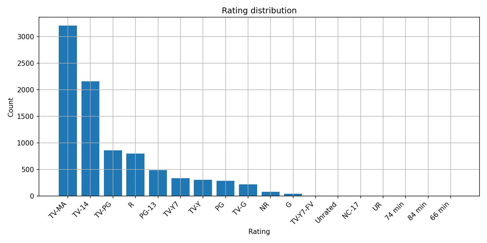
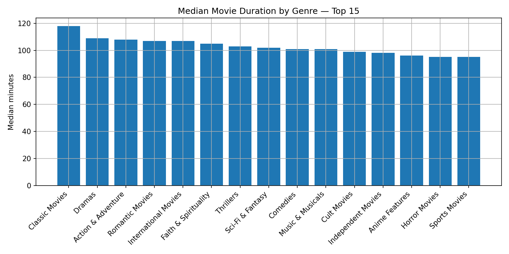
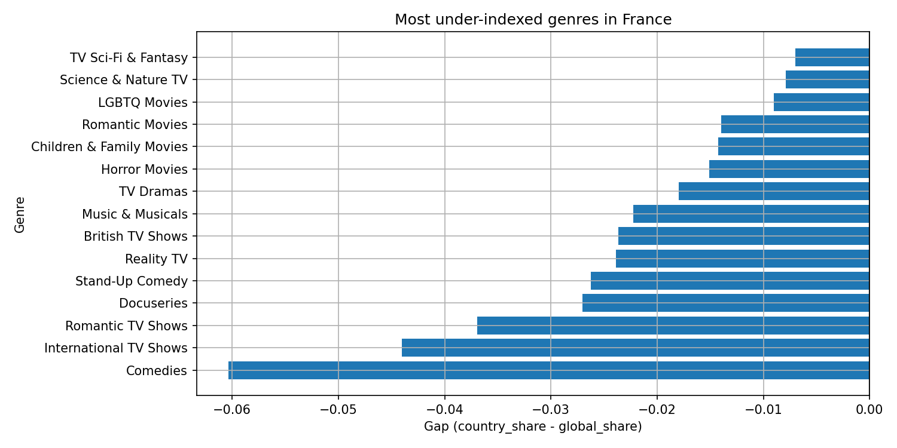

# Netflix Content Strategy (Python · VS Code · Jupyter)

> This repository turns the public Netflix catalog metadata into clear, business-ready insights that a content team can act on.  
> Focus: **data/business analytics**. I run everything from a single Jupyter notebook in VS Code.

---

## 📌 Why I built this

Streaming teams constantly ask:
- *What should we commission next and in which market?*
- *Is our catalog balanced across ratings and genres?*
- *Where are we under-serving viewers by genre and country?*

This project addresses those questions with a transparent analysis of the Netflix catalog dataset from **Kaggle** (`netflix_titles.csv`). It focuses squarely on an analyst’s toolkit: data cleaning, feature engineering, descriptive analytics, and crisp visuals.

---

## 🧠 Business problems & how this notebook solves them

1) **Catalog Evolution (Supply Mix)**
   - **Question:** How has the catalog grown by *type* (Movies vs TV Shows) over time?
   - **What I do:** Compute and plot titles added per year by type.
   - **Why it matters:** Guides portfolio planning (e.g., relevant movie/show mix).

2) **Ratings Composition (Maturity Profile)**
   - **Question:** What is the distribution of content ratings (e.g., TV-14, PG-13)?
   - **What I do:** Produce a rating distribution table + chart.
   - **Why it matters:** Signals if family or adult segments need refresh.

3) **Genre Concentration (What We’re Known For)**
   - **Question:** Which genres dominate the catalog overall and by type?
   - **What I do:** Build a **Top Genres** table and a **Genre × Type** heatmap.
   - **Why it matters:** Identifies crowded vs. niche areas to inform slate balance.

4) **Country–Genre Content Gaps (Where to Invest)**
   - **Question:** Which genres are **under-indexed** within a given country relative to global share?
   - **What I do:** Compute  
     `gap = country_share(genre) – global_share(genre)`  
     and visualize the most under-represented genres for a selected country (e.g., France/India/US).
   - **Why it matters:** Directly suggests **acquisition/commission** opportunities by market.

5) **Viewing Time (Operational Lens)**
   - **Question:** Which genres tend to run longer/shorter?
   - **What I do:** Parse duration and chart **median movie duration by genre**.
   - **Why it matters:** Helps programming calendars and “time to watch” UX rows.

---

## 🗂️ Repository structure

.
├── main.ipynb (Jupyter)
└── reports/
├── figures/ # PNG charts auto-saved by the notebook
└── tables/ # CSV tables (e.g., genre matrix, gap tables)

---

## 🧪 Methods (what’s inside the notebook)

- **Load & Clean:** lower-case headers, trim whitespace, parse `date_added`, extract `release_year`, standardize `rating` and `type`, and drop duplicates.
- **Feature Engineering:**  
  - `year_added`, `month_added`  
  - `duration_minutes` (movies direct, TV with a documented heuristic)  
  - convert comma-separated fields (genres/countries/cast/director) into **lists** for robust `explode` operations
- **Analysis & Visuals:**  
  - Trend of titles by year & type  
  - Rating distribution  
  - Top genres (overall)  
  - **Genre × Type** heatmap  
  - Median **movie duration** by genre  
  - **Country–Genre gaps** (full table + focused chart for a chosen country)

---

## 📈 Figures

**Catalog Trend (Movies vs TV Shows)**  

**Rating Distribution**  

**Top 20 Genres**  

**Genre × Type Heatmap**  

**Median Movie Duration by Genre**  

**Country–Genre Content Gaps (example: France)**  

---

## 🧩 How this helps the Neflix

- **Commissioning & Acquisition:**  
  The **gap analysis** pinpoints under-served genres by country, creating a ready-made shortlist for acquisitions or local commissions.

- **Portfolio Balance & Brand Positioning:**  
  The **ratings** and **genre mix** reveal where the slate is skewed, informing quarterly targets (e.g., “+X family titles before holidays”).

- **Programming & UX:**  
  **Duration** insights support scheduling blocks and “quick watch” collections that align with audience time budgets.

- **Leadership Snapshot:**  
  Two slides—trend and the gap chart for a target market—are enough to brief decision-makers weekly.

---

## 📚 Dataset

- **Source:** Kaggle — *Netflix Movies and TV Shows* (`netflix_titles.csv`).  
  (Community-compiled metadata originally scraped from Netflix’s public catalog pages.)
  
---

## 🔧 Tech stack

- **Python** (Jupyter in **VS Code**)  
- `pandas`, `numpy`, `matplotlib`  
- Clean, auditable cells; **no scikit-learn / no ML**

---

## 📝 Author

Built by **Suvayan Rakshit** as a portfolio-grade analytics project focused on **business impact**, **reproducibility**, and **clarity**.

